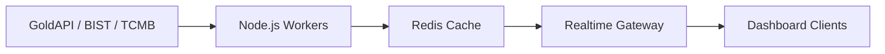

<div align="center">


</div>

<p align="center">
  
</p>

<div align="center">


<br>


<br><br>


<br><br>

<a href="https://www.linkedin.com/in/kerem-y%C3%BCksel-b112a2365/" target="_blank">

</a>

<a href="https://www.instagram.com/keremyukseel_/" target="_blank">

</a>

<a href="mailto:yourmail@gmail.com">

</a>

</div>


# ⚡ About Me

```yaml
name: Kerem Yüksel

role:
  - Full-Stack Developer
  - Mobile Architect
  - Game Developer
  - SaaS Engineer
  - AI Orchestration Engineer

specialization:
  - Realtime Backend Systems
  - High Performance Mobile Apps
  - Cross Platform Architectures
  - Multiplayer Infrastructure
  - Game Engine Development
  - AI Workflow Automation

mindset:
  - "Performance is a feature."
  - "Architecture matters."
  - "Production > Prototype."
```


# 🌌 Engineering Vision

<table>
<tr>
<td width="60%">

Modern yazılımı yalnızca uygulama geliştirmek olarak görmüyorum.

Benim için mühendislik:

- ⚡ Milisaniyelik veri akışları yönetmek
- 🎮 Akıcı oyun deneyimleri tasarlamak
- 🧠 Ölçeklenebilir backend mimarileri kurmak
- 🚀 Gerçek zamanlı sistemler geliştirmek
- 🛰️ Production-grade SaaS platformları inşa etmek
- 🤖 Otonom AI agent sistemleri tasarlamak

</td>

<td width="40%">


</td>
</tr>
</table>


<div align="center">

# ⚡ TECHNOLOGY MATRIX ⚡


<br><br>


</div>


# 🧠 Core Technologies

<details open>
<summary><b>🎮 Mobile & Game Development</b></summary>

<br>

```yaml
Frontend:
  - Flutter
  - Dart
  - React
  - TailwindCSS

Game Engine:
  - Flame Engine
  - Physics Systems
  - Collision Detection
  - Render Optimization

Architecture:
  - Clean Architecture
  - Riverpod
  - BLoC
  - SOLID Principles
```

</details>


<details open>
<summary><b>⚙️ Backend & Infrastructure</b></summary>

<br>

```yaml
Backend:
  - Node.js
  - TypeScript
  - Express.js

Database:
  - PostgreSQL
  - Redis
  - Firestore

Realtime:
  - WebSocket
  - Event Systems
  - Queue Systems
  - Cron Workers

Security:
  - JWT
  - Refresh Tokens
  - RBAC
  - Audit Logging
```

</details>


<details open>
<summary><b>🤖 AI Orchestration</b></summary>

<br>

```yaml
AI Systems:
  - CrewAI
  - Dify
  - Autonomous Agents
  - Multi-Agent Workflows

Automation:
  - Prompt Pipelines
  - AI Routing
  - Intelligent Workflows
```

</details>


# 🏆 Featured Projects


# 🌌 Nebula Match


<table>
<tr>
<td width="65%">

Premium uzay temalı puzzle oyunu. Kozmik atmosfer, akici animasyonlar ve patlama VFX odakli bir deneyim sunar.

### 📥 Play Store

[](https://play.google.com/store/apps/details?id=com.yuksgames.nebulamatch)

[Nebula Match - Play Store](https://play.google.com/store/apps/details?id=com.yuksgames.nebulamatch)

Indirme: 1K+

### ⚡ Highlights

- Tamamen cevrimdisi oynanabilir (WiFi veya internet gerekmez)
- HD galaksi gorunumleri, neon nebulalar ve rahatlatan patlama efektleri
- Strateji + arcade modu bir arada
- Yuzlerce seviye, haftalik guncellemelerle uzun omur

### ⚙️ Technologies

```txt
Flutter • Flame Engine • Firebase • Firestore • Hive
```

</td>

<td width="35%">

<div align="center">


<br><br>


<br><br>


</div>

</td>
</tr>
</table>


# 🚜 Flow & Farm


```yaml
genre:
  - Hybrid Strategy
  - Puzzle
  - Resource Management

systems:
  - Graph Theory
  - Grid Algorithms
  - Smart Pathfinding
  - Dynamic Economy
  - Procedural Systems
```


# 🏢 AurumOS SaaS Platform


<table>
<tr>
<td width="60%">

### 🧩 Product Overview

- Kuyumcular icin B2B SaaS, white-label yapida
- $50 / sirket / ay, sinirsiz dukkan ve calisan
- Flutter cross-platform (iOS, Android, Windows, macOS)
- Linux backend uzerinde guvenli ve olceklenebilir altyapi

### 🧠 Core Modules

- Dashboard: anlik fiyat, satis ve stok metrikleri
- Dukkan ve calisan yonetimi, granuler yetkilendirme
- Stok, satis / alis islemleri, PDF makbuz
- Raporlama (PDF/Excel), bildirimler, akilli hesap makinesi

### 📡 Price Engine

- GoldAPI / TCMB / BIST kaynaklarindan 20-60s arasi cekim
- Redis cache + WebSocket push, fallback son gecerli fiyat
- Audit log ile islem takibi

### ⚡ Enterprise Infrastructure

- Multi-tenant architecture
- Redis realtime caching
- WebSocket live sync
- PostgreSQL synchronization
- JWT + RBAC security
- Audit tracking systems

### ⚡ Realtime Flow



</td>

<td width="40%">

<div align="center">


<br><br>


</div>

</td>
</tr>
</table>


# 🛰️ Project ORION


```yaml
focus:
  - Hardware Simulation
  - Industrial Design
  - Technical Modeling
  - Circuit Prototyping

precision:
  - 0.01mm accuracy
```


# 📊 Engineering Metrics

<div align="center">

| ⚡ Metric | 🚀 Result |
|---|---|
| Backend Response | `<50ms` |
| Render Stability | `60FPS / 120FPS` |
| Realtime Sync | `Milliseconds` |
| Platforms | `iOS • Android • Windows • macOS` |
| Architecture | `Production-Grade` |
| Security | `JWT + RBAC` |

</div>


# 📈 GitHub Analytics

<div align="center">


<br><br>


<br><br>


</div>


# ⚡ Current Focus

```txt
⚡ Realtime SaaS Infrastructure
⚡ AI Agent Systems
⚡ Multiplayer Backend Architectures
⚡ Advanced Mobile Rendering
⚡ Distributed Systems
⚡ Performance Optimization
```


# 🧬 Development Principles

<div align="center">

```txt
Performance First
Scalability Always
Architecture Matters
Clean Code Wins
Production > Prototype
```

</div>


# 🌐 System Design Mindset

```yaml
Performance:
  - Low latency systems
  - Smart caching
  - Optimized rendering

Scalability:
  - Distributed architecture
  - Horizontal scaling
  - Queue systems

Security:
  - JWT Authentication
  - RBAC Authorization
  - Secure APIs

Experience:
  - Smooth UI
  - Stable FPS
  - Fluid UX
```


# 🚀 Future Roadmap

- 🌌 Multiplayer game infrastructure
- 🤖 Autonomous AI systems
- 🛰️ Distributed cloud ecosystems
- ⚡ Ultra-low latency platforms
- 🎮 Premium cross-platform games


# ⚡ LIVE TERMINAL STATUS

```bash
> Initializing KeremYuksel.exe ...

[██████████████████████████] System Loaded

✔ Backend Architectures Ready
✔ Realtime Systems Active
✔ AI Agents Online
✔ Mobile Rendering Stable
✔ Production Systems Operational

STATUS: ONLINE
```


<div align="center">


</div>
